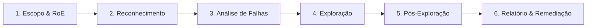
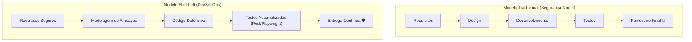

# Guia Fundamental de Pentest e Segurança de Software

* **Instituição:** Faculdade de Tecnologia de Ferraz de Vasconcelos (FATEC-FV)
* **Curso:** Análise e Desenvolvimento de Sistemas (ADS)
* **Disciplina:** Teste de Software
* **Professor:** Alexander Bastos
* **Aluno:** Josias Sobrinho

---

## 1. O que é um Pentest?

O **Pentest** (*Penetration Testing*, ou Teste de Intrusão) é um ataque cibernético simulado, controlado e expressamente autorizado contra a infraestrutura, redes e aplicações de uma organização. O objetivo primário não é causar prejuízos, mas identificar, explorar e comprovar vulnerabilidades antes que agentes maliciosos (*black hats*) o façam.

> [!NOTE]
> **Analogia Didática:** Imagine uma agência bancária de alta segurança que contrata um auditor especializado para tentar invadir seu próprio cofre fora do horário de expediente. Se o auditor conseguir abrir a fechadura ou burlar os sensores infravermelhos, ele não roubará o dinheiro: ele documentará minuciosamente cada brecha e ensinará a equipe técnica como reforçar as portas e alarmes.

---

## 2. Abordagens de Pentest (Nível de Visibilidade)

A profundidade e a postura técnica do pentester variam conforme o nível de conhecimento prévio disponibilizado pela contratante:

| Abordagem | Informações Prévias | Perspectiva Simulada | Vantagens | Foco Típico |
| :--- | :--- | :--- | :--- | :--- |
| **Black Box** *(Caixa Preta)* | Nenhuma (apenas o domínio ou URL) | Invasor externo comum na Internet | Realismo máximo quanto à postura pública | Descoberta de ativos, portas abertas, falhas de perímetro |
| **Gray Box** *(Caixa Cinza)* | Parciais (credenciais de usuário comum, documentação de API) | Usuário legítimo, parceiro ou colaborador com poucos privilégios | Custo-benefício equilibrado; agiliza a fase de reconhecimento | Quebra de controle de acesso (BOLA/IDOR), escalada de privilégios |
| **White Box** *(Caixa Branca)* | Totais (código-fonte, arquitetura, infraestrutura, acessos root) | Auditor interno ou desenvolvedor sênior | Cobertura exaustiva de código e configuração (*Defense in Depth*) | Falhas arquiteturais, criptografia fraca, Race Conditions, injeções |

---

## 3. As Fases Metodológicas de um Pentest Profissional

Um teste de intrusão segue metodologias internacionais consolidadas, como o **OWASP WSTG** (*Web Security Testing Guide*), **PTES** (*Penetration Testing Execution Standard*) e **OSSTMM**:

1. **Definição de Escopo e Regras de Engajamento (*Rules of Engagement - RoE*):**
   - Formalização contratual do que pode e do que não pode ser testado (IPs, URLs, janelas de horário).
   > [!WARNING]
   > Executar testes de intrusão sem autorização expressa por escrito configura crime cibernético tipificado no Brasil (Lei Carolina Dieckmann nº 12.737/2012 e Art. 154-A do Código Penal).

2. **Reconhecimento e Coleta de Informações (*OSINT*):**
   - Mapeamento passivo e ativo de tecnologias, subdomínios, servidores web, portas abertas e versões de bibliotecas.

3. **Análise e Modelagem de Vulnerabilidades:**
   - Varredura com ferramentas e análise manual para localizar fragilidades lógicas, cabeçalhos ausentes, endpoints desprotegidos e rotas administrativas.

4. **Exploração Controlada (*Exploitation*):**
   - Tentativa deliberada de quebra de barreiras de defesa para comprovar a viabilidade técnica da falha (ex: injeção de payloads, burla de autenticação, força bruta).

5. **Pós-Exploração e Análise de Impacto:**
   - Avaliação do dano real: que dados sensíveis (*PII*) poderiam ser vazados? É possível persistir no sistema ou saltar lateralmente para outros servidores?

6. **Relatório Técnico e Executivo (*Reporting*):**
   - Apresentação dos achados com classificação de severidade (ex: pontuação CVSS), evidências reproduzíveis (*Proof of Concept - PoC*) e roteiro cirúrgico de correção para o time de desenvolvimento.

---

## 4. O Paradigma *Shift-Left* e a Cultura DevSecOps

Historicamente, a segurança da informação era tratada como a última etapa da entrega de software — um teste tardio antes de subir para produção. 

### O Custo da Correção de Falhas (Curva de Boehm)
De acordo com a clássica regra da Engenharia de Software, o custo de remediar uma vulnerabilidade cresce exponencialmente à medida que o software avança no ciclo de vida:
* **Fase de Requisitos / Design:** Custo base ($1x).
* **Fase de Desenvolvimento:** Custo moderado ($5x - $10x).
* **Fase de Testes / Homologação:** Custo alto ($15x - $30x).
* **Produção (Pós-Incidente / Vazamento):** Custo catastrófico ($60x - $100x+), somando multas da LGPD, perícia forense e danos irreparáveis à reputação da marca.

---

## 5. Modelagem de Ameaças no Login (Metodologia STRIDE)

Antes de escrever qualquer linha de código, a equipe analisa a tela de autenticação através do modelo de ameaças **STRIDE** (criado pela Microsoft):

| Ameaça (STRIDE) | Risco Concreto no Login | Contramedida Implementada na Aplicação |
| :--- | :--- | :--- |
| **S**poofing *(Falsificação de Identidade)* | Atacante se passa por usuário legítimo via Força Bruta ou Credential Stuffing. | Rate Limiting Híbrido (IP + Conta-Alvo) com bloqueio em HTTP 429 após 5 tentativas. |
| **T**ampering *(Adulteração de Dados)* | Manipulação de tokens de requisição ou modificação de corpo JSON em trânsito. | Tokens Anti-CSRF criptograficamente seguros com rotação dinâmica por requisição (*Single-Use*). |
| **R**epudiation *(Repúdio)* | Usuário ou invasor nega ter realizado tentativas de invasão ou login. | Trilha auditável com `SecurityLogger`, mascarando credenciais e preservando integridade de IPs. |
| **I**nformation Disclosure *(Vazamento de Info)* | Mensagens de erro que indicam se o e-mail existe no banco (*User Enumeration*). | Mensagens uniformes ("Credenciais inválidas.") e Dummy BCrypt Hash para mitigar Timing Attacks. |
| **D**enial of Service *(Negação de Serviço)* | Envio de senhas com megabytes de tamanho para sobrecarregar a CPU no cálculo do hash BCrypt. | Limite estrito de 128 caracteres (`MAX_LENGTH`) antes de invocar o algoritmo criptográfico. |
| **E**levation of Privilege *(Elevação de Privilégio)* | Invasor reutiliza cookie de sessão sequestrado via XSS ou rede desprotegida. | Cookies com flags `HttpOnly`, `SameSite=Lax`, `Secure` e cabeçalho `Strict-Transport-Security` (HSTS). |

---

## 6. Como os Testes do Nosso Laboratório Validam as Defesas

O laboratório prático da **Aula 08** exemplifica o ápice do *Security by Design*: cada teste automatizado foi desenhado como um pentest em miniatura dentro do pipeline de CI/CD:

1. **Teste contra Timing Attack e Enumeração de Usuários:**
   - [AuthenticateCustomerUseCaseTest.php](file:///var/www/html/teste-software/Aula-08/tests/Unit/Application/AuthenticateCustomerUseCaseTest.php): Valida que a resposta demora o mesmo tempo de CPU para usuários reais e fictícios.
2. **Teste contra Força Bruta Distribuída:**
   - [RateLimitTest.php](file:///var/www/html/teste-software/Aula-08/tests/Integration/RateLimitTest.php): Simula múltiplos atacantes em IPs diferentes alvejando a mesma conta de e-mail e comprova o disparo do HTTP 429.
3. **Teste contra Replay de Token Anti-CSRF:**
   - [CsrfProtectionTest.php](file:///var/www/html/teste-software/Aula-08/tests/Integration/CsrfProtectionTest.php): Garante que a reutilização de um token já consumido seja prontamente repelida com HTTP 403.
4. **Teste de Injeção e Mass Assignment:**
   - [InputSanitizationTest.php](file:///var/www/html/teste-software/Aula-08/tests/Integration/InputSanitizationTest.php): Tenta injetar scripts maliciosos (`<script>`), aspas SQL e propriedades espúrias no DTO de entrada.
5. **Teste E2E Visual no Navegador:**
   - [test_playwright_telas.py](file:///var/www/html/teste-software/Aula-08/test_playwright_telas.py): Garante que a experiência do usuário, mensagens de acessibilidade (`aria-live`) e renderização comportem-se exatamente conforme os requisitos de segurança.

---

## 7. Ferramentas Essenciais do Ecossistema de Segurança

Para quem deseja se aprofundar na carreira de Segurança Ofensiva (*Red Team*) ou Defensiva (*Blue Team/AppSec*):

* **Interceptação e Proxy HTTP:** *Burp Suite Community/Professional*, *OWASP ZAP* (Zed Attack Proxy).
* **Varredura de Redes e Portas:** *Nmap*, *Masscan*.
* **Auditoria de Força Bruta e Senhas:** *Hydra*, *Hashcat*, *John the Ripper*.
* **Análise Estática de Código (SAST):** *PHPStan*, *SonarQube*, *Semgrep*.
* **Análise de Dependências (SCA):** *Composer Audit*, *Trivy*, *OWASP Dependency-Check*.
* **Automação de Testes de Segurança (DAST):** *Pest PHP*, *Playwright*, *Behave*.

---

## 8. Conclusão e Próximos Passos

Integrar o pensamento do pentester desde a concepção do software não torna o processo mais lento: torna o produto final resiliente, sustentável e pronto para o mercado corporativo. 

> [!TIP]
> Para expandir os critérios de segurança e usabilidade na criação de novas contas e gestão de credenciais, consulte o documento complementar [docs/futuras-implementações.md](file:///var/www/html/teste-software/Aula-08/docs/futuras-implementa%C3%A7%C3%B5es.md).
